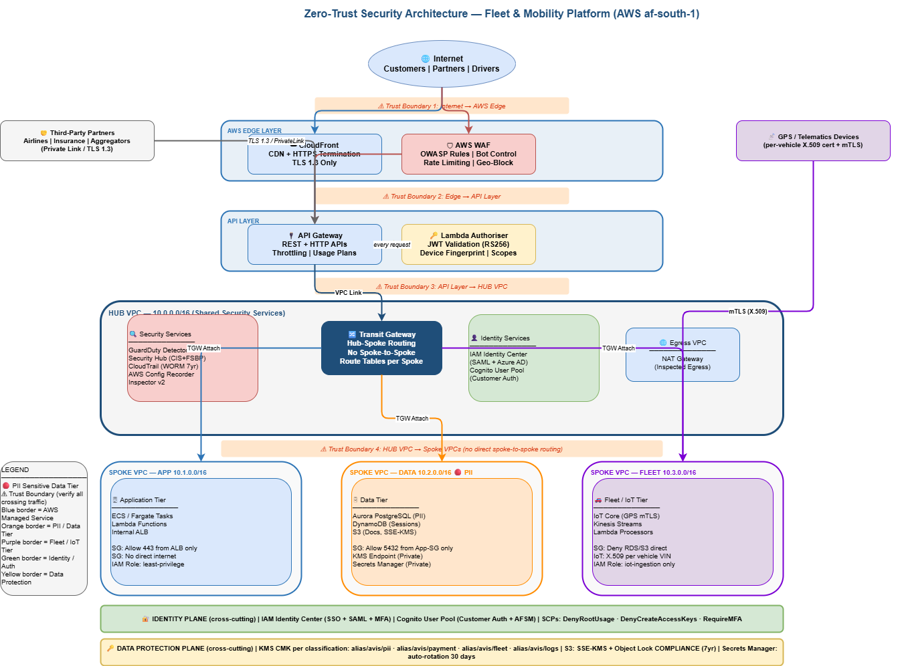
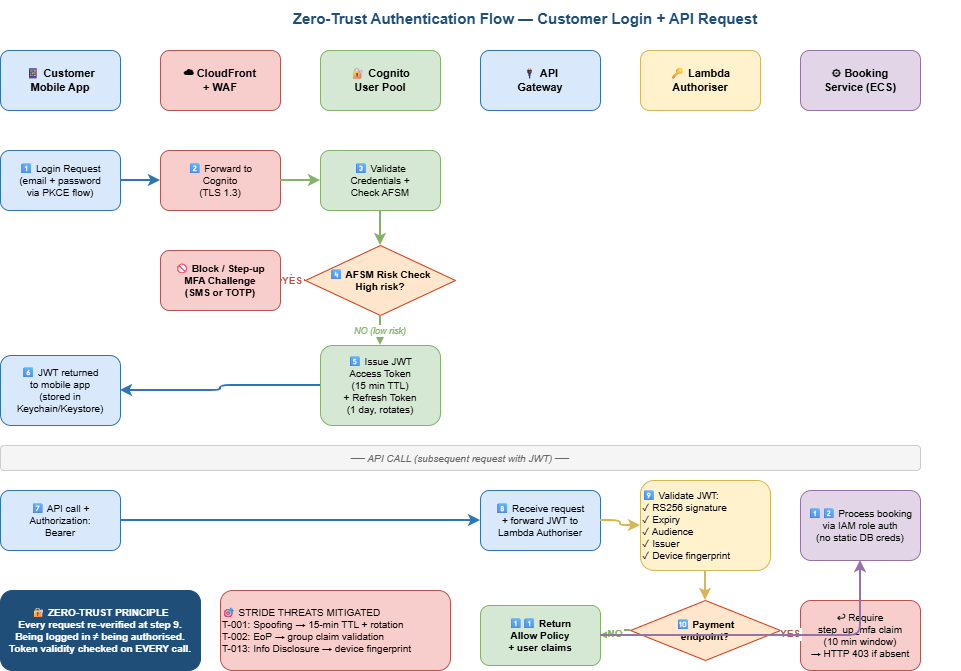

# Zero-Trust Security Architecture
## Fleet & Mobility Order Platform — Avis South Africa

> **Portfolio project** demonstrating enterprise security architecture
> for a car rental platform modernisation on AWS.

## Frameworks
| Framework | Purpose |
|-----------|---------|
| SABSA | 6-layer security architecture structure |
| STRIDE | Threat modelling methodology |
| Zero-Trust | NIST SP 800-207 implementation |
| TOGAF | Enterprise architecture alignment |

## Compliance
`POPIA` `ISO 27001` `NIST CSF` `GDPR` `PCI-DSS`

## Repo Structure
```
├── architecture/      # SABSA matrix + high-level design
├── threat-modelling/  # STRIDE threat register + DFDs
├── grc/               # Compliance matrices + evidence
├── adr/               # Architecture Decision Records
├── security-by-design/# NFRs for App/Data/Integration teams
├── terraform/         # IaC modules (Phase 2)
├── incident-response/ # IR playbooks
└── docs/              # Supporting documentation
```

## Status
- [x] Phase 1: Repo structure
- [ ] Phase 2: SABSA matrix
- [ ] Phase 3: STRIDE threat register
- [ ] Phase 4: Architecture diagrams
- [ ] Phase 5: ADRs
- [ ] Phase 6: Compliance matrix
- [ ] Phase 7: Security-by-design handoff docs

## Cloud Platform
AWS (af-south-1 — Cape Town) for POPIA data residency

## Architecture Diagrams

### VPC Hub-Spoke Topology


### Authentication Flow
